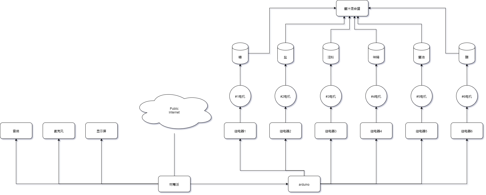
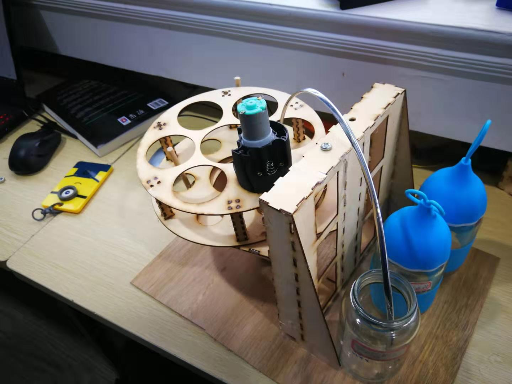
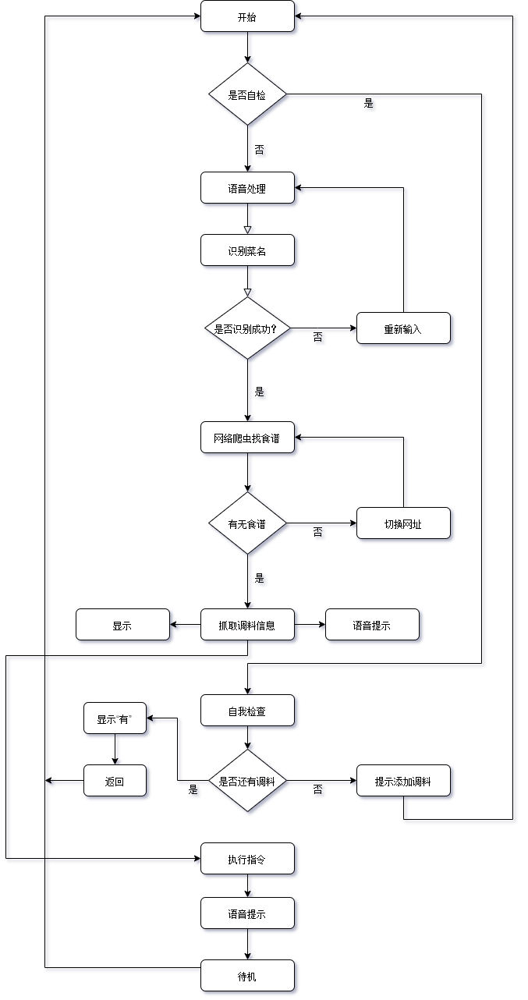
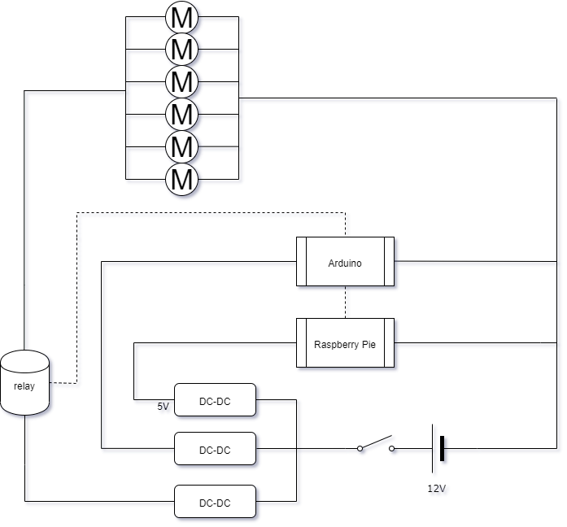
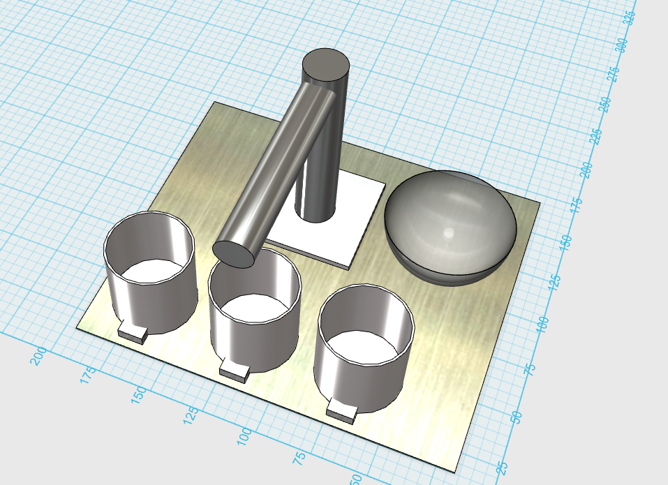

#  烹饪酱汁预调机器人

## 课题起因

现在的生活节奏加快，年轻人业余时间少， 但又希望体验烹饪的乐趣。 由于烹饪经验不足，需要先网上查菜谱，然后烹饪。

买回烹饪的主料以后， 按照菜谱做菜时，调味品的比例需要根据主料的重量计算，然后混合，非常麻烦，调料混合时锅里还在烹饪，掌握不好，容易手忙脚乱，造成烧糊等现象。 有时候调料比例计算错误，导致过甜，过咸，口味不佳。 

因此，希望有一种可以自动计算调料比例并且自动混合的厨房机器人问世，为年轻人提供更好的烹饪体验，传承中华美食文化。

## 问卷调查

对于
根据问卷调查，认为烹饪做菜时难度最大的原因有： 火候掌握不好 60%， 调料比例不对 30%， 。。。。。。。

## 解决方案

设计一种烹饪酱汁混合机器人，可以根据菜谱以及主料的重量，自动完成酱汁的配制，方便烹饪。
具体功能如下：
1. 能够用语音与用户对话，得知要做什么菜
2. 能够提示用户根据几人份的要求，称重准备特定重量的主料
3. 利用网络爬虫的得到菜谱
4. 根据主料重量计算出配料。
5. 将酱油，醋，油，料酒，盐，味精，糖根据菜谱和主料重量计算出的重量充分混合做成酱汁。
6. 语音提示操作步骤和酱汁加入的时机。

## 创新点

1.利用Pytho和网络爬虫得到菜谱  
2.分析菜谱得到调味品与主料的比例  
3.够混合液体和粉末的混合头装置  
4.语音交互简化操作

## 系统结构

## 机械结构设计

## 软件设计

## 电路设计

## 制作过程

## 系统测试

## 问题与展望

					  _固体调料：研磨器，对粗盐、胡椒；螺旋，对糖、味精等等
					 /
	关键技术路线 配酱料-半固半液：螺旋
					\
					 \_液体调料：阀门，对酱油、油、醋等等
					 
					 
## todo list

1 问卷星调查  开学前  2/17  
2 逐步填写表格  

## bom

arduino x1
rp x1
六联继电器 x1
电源 x1
电机 x6

# 解决Github无法显示图片问题

参见 [如何修改host文件添加github](http://blog.csdn.net/weixin_42128813/article/details/102915578)
