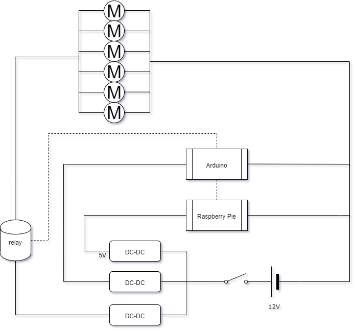
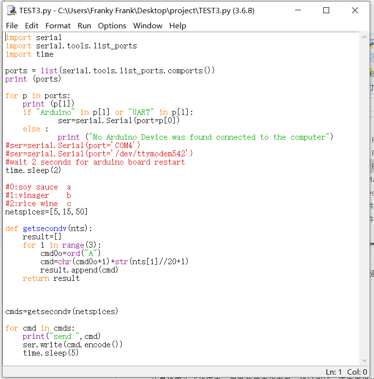
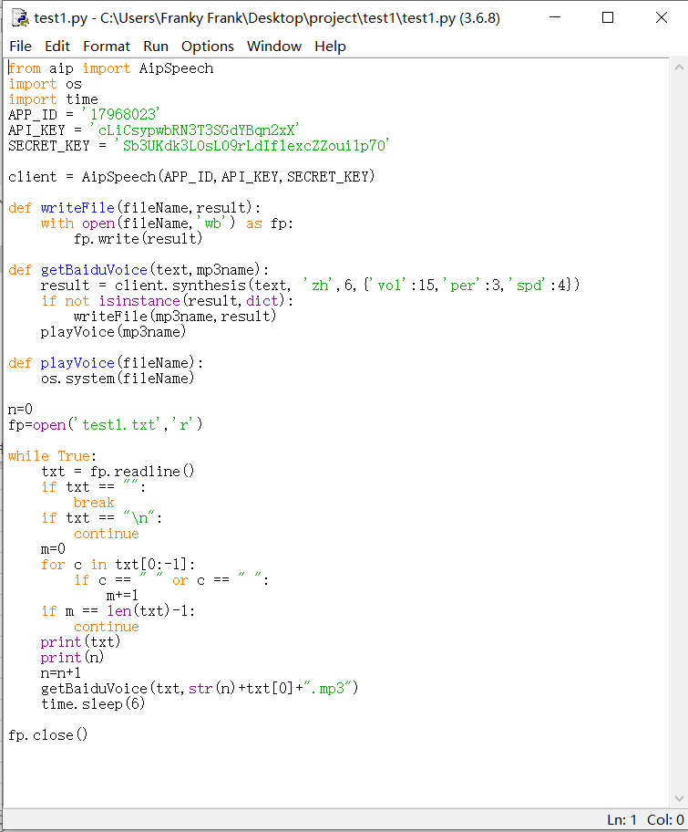
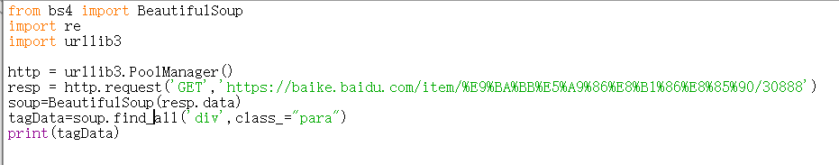
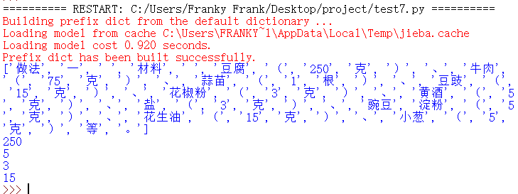
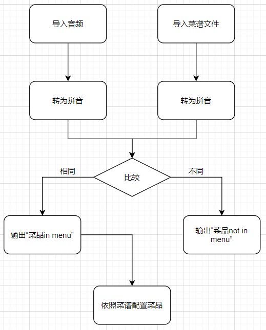
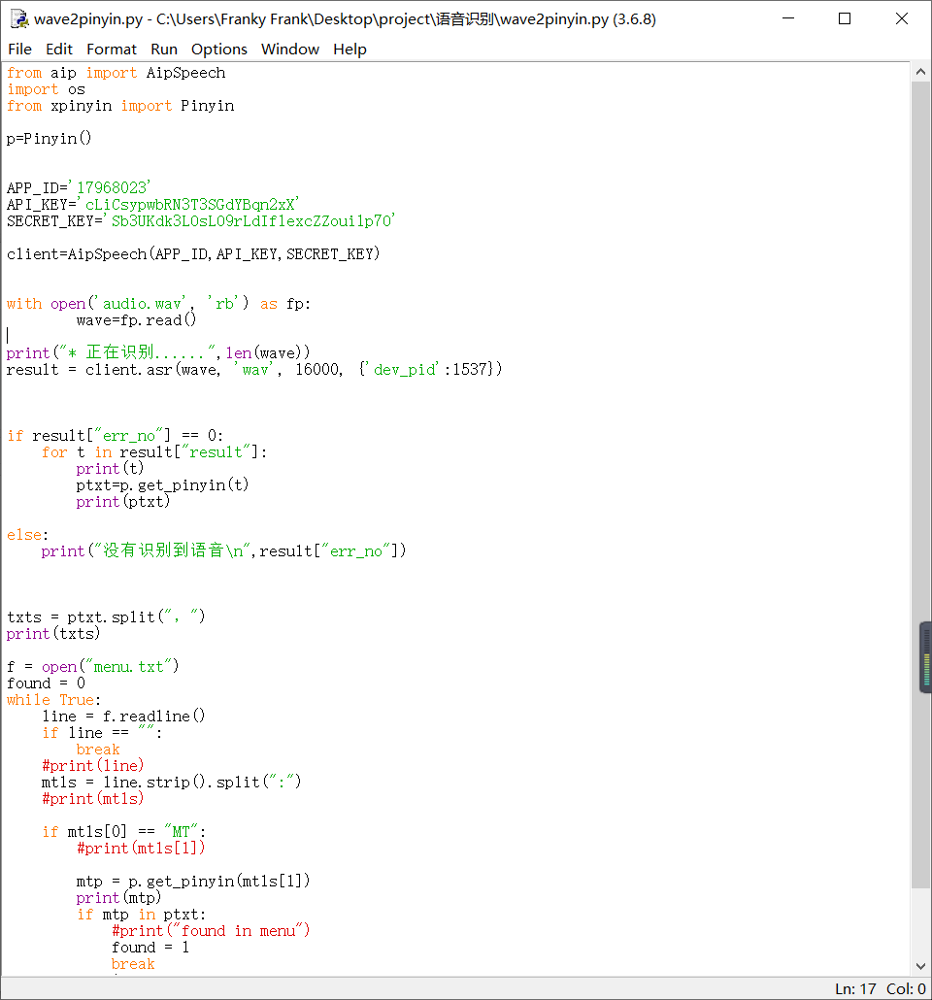
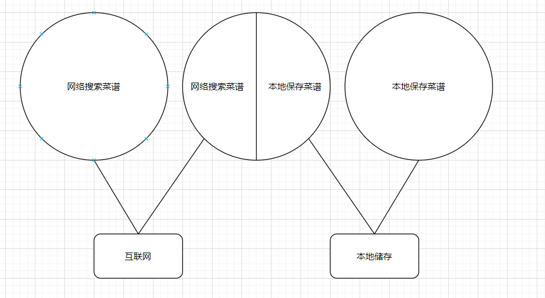

# 基于Python自然语言处理与网络爬虫的智能厨房助手
组长：朱宇菘  
指导老师：谢凯年  
班级：高一（3） 
日期：2019.4.5  

# 摘要

在家中做菜的时候，经常会发生无法掌控调料用量的情况。本研究针对做菜时调味品添加量太多/太少的问题， 设计了一种厨房助理机器人。它能够帮助厨师更快处理菜品、把控质量。装置综合利运用语音识别人机交互技术，在网络爬虫技术的帮助下，能够根据给出的菜名在网上找到菜谱，利用自然语音处理技术，得到调料的种类和比例，通过继电器控制电机，将酱油，醋，料酒等调料按比例混合，置于调料碗内供使用。经实验验证，该装置可以根据语音命令，在3秒内查询并分析好菜谱，主人确认后，在5秒内以5%的精确度完成调料的配置。

1.利用Pytho和网络爬虫得到菜谱  
2.分析菜谱得到调味品与主料的比例  
3.够混合液体和粉末的混合头装置  
4.语音交互简化操作  

## 关键词
1.厨房助手  
2.网络爬虫    
3.自动调料混合   
4.语音识别  
5.自然语言处理  

# 正文 

## 1. 引言
现在的生活节奏加快，年轻人业余时间少， 但又希望体验烹饪的乐趣。 由于烹饪经验不足，需要先网上查菜谱，然后烹饪。

买回烹饪的主料以后， 按照菜谱做菜时，调味品的比例需要根据主料的重量计算，然后混合，非常麻烦，调料混合时锅里还在烹饪，掌握不好，容易手忙脚乱，造成烧糊等现象。 有时候调料比例计算错误，导致过甜，过咸，口味不佳。 

因此，希望有一种可以自动计算调料比例并且自动混合的厨房机器人问世，为年轻人提供更好的烹饪体验，传承中华美食文化。

## 2. 研究背景

### 2.1 研究意义与国内外研究现状

为了了解国内外现状，我们在淘宝和专利大王以及英文搜索引擎上用关键词“厨房助手”进行查询，结果如下：
1.淘宝（关键词：智能料理机）  
厨师机器人小美：通过预制程序控制一个带有搅拌功能的多用途锅进行蒸、煮、炒以及多种食材的处理，需人工加料。  
全自动炒菜机：通过预制程序控制一个类似洗衣机滚筒的锅对食材进行翻炒、混合，需人工加料。

2.专利大王
多用抓手机器人：专利号US16534207，通过替换手部零件实现对盛食物的框的抓取。  
油炸机器人：US16534169，通过搅动油炸框代替人工进行油炸操作。

3.英文版bing（关键词：kitchen machine）
智能空气炸锅：通过对温度的控制，掌握食材的被炸程度。

具有进行烹饪的能力，可以在人给定菜式并加入调料的情况下代替人工进行多种形式的料理。缺点：操作需人工加料，较为繁琐。
为了了解国内外现状，我们在淘宝和专利大王上用关键词“厨房助手”进行查询，发现确实存在厨房助手类的发明，例如专利号US16534207多用抓手机器人以及专利号US16534169油炸机器人，但不存在与研究目标相近的发明。现有发明主要以解决单一类型厨房自动化的机器人为主，旨在提高厨房运作的效率（在这一点上与我的发明一致），也有进行菜谱查询的软件，但暂未出现可以人性化地为厨师提供辅助的机器人。

### 2.2 相关概念及其含义的界定
Q:厨房助手是什么?  
A:我着手研发的厨房助手不执行烹饪，但是可以帮助厨师快速配置调料，也可以帮助小白进行菜品口味把控。  
Q：Why Python?  
A：Python是一款强大的编程软件，具备了编写网络爬虫、语音识别以及自然语言处理功能，因此采用它作为本项目的基础。  
Q：什么是网络爬虫？  
A:网络爬虫也叫网页蜘蛛，网络机器人，是一种用来自动浏览万维网的程序或者脚本。爬虫可以验证超链接和HTML代码，用于网络抓取。网络搜索引擎等站点通过爬虫软件更新自身的网站内容或其对其他网站的索引。  
Q:什么是自然语言处理？  
A:自然语言处理是计算机科学领域与人工智能领域中的一个重要方向。它研究能实现人与计算机之间用自然语言进行有效通信的各种理论和方法。自然语言处理是一门融语言学、计算机科学、数学于一体的科学。因此，这一领域的研究将涉及自然语言，即人们日常使用的语言，所以它与语言学的研究有着密切的联系，但又有重要的区别。在此项课题中，这一方法的应用旨在分析不同的菜谱并将它们整合起来。

## 3. 研究对象和方法
### 3.1 方法
设计一种烹饪酱汁混合机器人，可以根据菜谱以及主料的重量，自动完成酱汁的配制，方便烹饪。
具体功能如下：
1. 能够用语音与用户对话，得知要做什么菜
2. 能够提示用户根据几人份的要求，称重准备特定重量的主料
3. 利用网络爬虫的得到菜谱
4. 根据主料重量计算出配料。
5. 将酱油，醋，油，料酒，盐，味精，糖等根据菜谱和主料重量计算出的重量充分混合做成酱汁。
6. 语音提示操作步骤和酱汁加入的时机。

### 3.2 系统结构
#### 1.系统总体结构
  
通过从用户处采集的语音，使用互联网获取菜谱，并由树莓派进行处理、下达命令，由Arduino控制执行。
#### 2.机械结构设计
  
设计了六个固体调料投放孔以及一个液体调料投放口，固体调料投放采用研磨器改装，液体调料用水泵输送。
#### 3.电路设计
  
电路采用开源硬件Arduino以及树莓派控制六联继电器实现自动控制，可以实现对六种调料的投放。
#### 4.软件设计
  
软件使用Python编写，结合了语音识别与自然语言处理，实现人机交互；接着通过对于菜谱的检索获取调料信息，使用树莓派向Arduino发送信号，控制调料配制。

## 4. 结果与数据分析
### 4.1 需求调查
根据调查结果，可知在各年龄段大多数过下厨的人群中，出现了对于烹饪的水平参差现象，同时年轻人对于烹饪的热情不高，倾向点外卖，虽然有人配置了小美但是对其操作并不熟悉，大多数人希望有一款这样的厨师助手出现。
 
### 4.2 液体酱汁泵测试  
采用如图装置测试酱汁泵与量杯水位的关系  
  
通过设定程序，测试了三个水泵电机输送水的效率。使用两个容量为100毫升的量杯，测定了开启各个电机后n秒泵出的水量，得知各电机泵出液体的速率一致且稳定。  
   
图为测试程序，通过修改变量netspices可以控制电机转动的时间长。
结果如下：  
    
经过试验，取得了各马达每秒输送的调料量，通过这一试验可以通过控制时间实现调料的量化控制。
### 4.3 语音播报功能
机器语音生成：  
1.开始烹饪：请说出您要做的菜名  
2.上次菜品： *宫保鸡丁*  
3.请确认  
4.请确认要做的量：单人份，双人份或三人份？  
5.请确认  
6.已识别。开始配置 *宫保鸡丁* 的调料  
（打* 处为变量）  
这是机器生成的语音，用于与用户的交互。经过测试，语音播报功能达到100%的准确率，可以使用户理解厨房助手的表达。  
  
此为程序代码。通过使用百度API实现了从文字到语音的转换。  
  
经过测试常用的几句语音的输出，该程序均可以准确地给出“test1.txt”文件中的语句对应的语音。在上图表格所示的测试中，转化的准确率达到了100%。

### 4.4 网络爬虫获取菜谱
通过使用网络爬虫，获取了特定网站的菜谱信息，并用程序将其转化为执行指令。  
部分代码（测试，以百度百科为例）：  
    
以下为抓取结果：  
  
经过爬取麻婆豆腐的菜谱，证明了爬虫程序的可靠性。
### 4.5 自然语言处理
利用自然语言处理中的基本“jieba”分词包，对爬取的菜谱语句进行分词，结果如下： 
  
运用关键词匹配，找到一个主料以及三个调料的重量。以下为源代码以及运行结果：
  
由运行结果可看出：主料豆腐用量是250克，三种调料用量分别为：黄酒5克，盐3克，花生油15克。这些数字经过按比例计算会通过串口输入给arduino，控制电机按比例混合调料。
### 4.6 语音识别
利用百度API实现语音识别的功能，先将用户所产生的语音录下，再将其转化为拼音格式并断句，然后调用菜谱（保存于本地的与网络爬虫找寻到的），将其也转化为菜谱，找到菜谱标题，与用户所给菜品名比较。若相同则输出“找到”，同时将菜谱其余部分读取，将其转化为指令并提交给执行单元处理；若不同则输出“没找到”。以下为流程图。

经过测试，此语音识别功能可以有效识别给与的命令并转化为执行指令。以下为部分代码。

## 5. 讨论
针对菜谱数量可能很大但是常用菜谱却不是很多这一缺陷，现有以下几种方案：  
1.仅采用网上搜索菜谱  
2.采用网上菜谱搜索与本地菜谱并用  
3.仅采用保存于本地的菜谱  
如图所示：  

对比可知：
方法1可以有效地找到菜谱，但是不能离线运行；  
方法2可以在已下载菜谱范围中找寻菜谱，但不能应对对新菜谱的需求；  
方法2兼顾了1、3的优点，不用担心断网，也不必担心找不到对应的菜谱，且可以把常用菜谱下载到本地，加快运行效率，是较好的选择。

# 结论
本项目针对当代人们对烹饪技巧掌握不熟练、酱料把握没有度的问题，创造性地提出了用厨房助理机器人来解决的方法，并设计了可以用语音与人交互、从网站上抓取食谱的厨房助手，初步测试结果表明，它能够理解主人的语音输入，并对其做出反应、配置相应调料，性能可达到较高的精度，具有一定的实用性。

# 不足与有待研究之处
现有六联继电器控制方法无法控制多于六个马达，可以在马达控制电路上再做文章。  
网络爬虫无法访问所有网站，故菜谱有局限，可添加本地菜谱来扩充。

# 致谢
本作品在创作过程中得到了上海交大学生创新中心的老师的大力支持，我作为初学者，对编程与电路设计等方面有许多不足，在此感谢老师们的大力支持，使我在短时间内入门，取得了各方面的进展。

# 参考文献

# 附录
调查初始数据
Arduino与树莓派之间的通信协议  
A: 1 - on  
a: 1 - off  
B: 2 - on  
b: 2 - off  
C: 3 - on  
c: 3 - off  
D: 4 - on  
d: 4 - off  
E: 5 - on  
e: 5 - off  
F: 6 - on  
f: 6 - off  
参考网址：https://blog.csdn.net/xylon_/article/details/98748848
