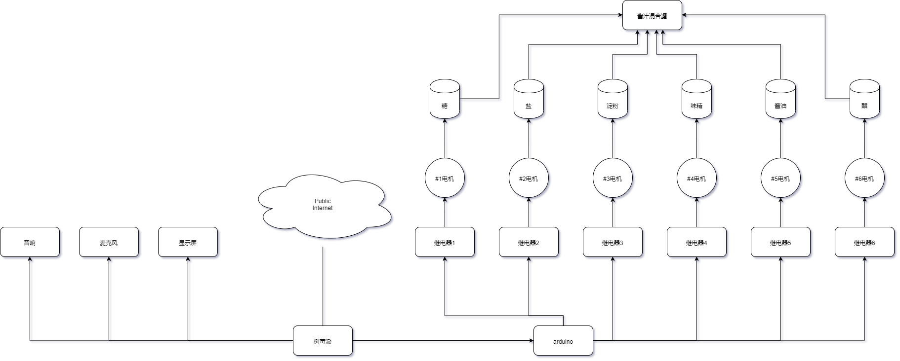
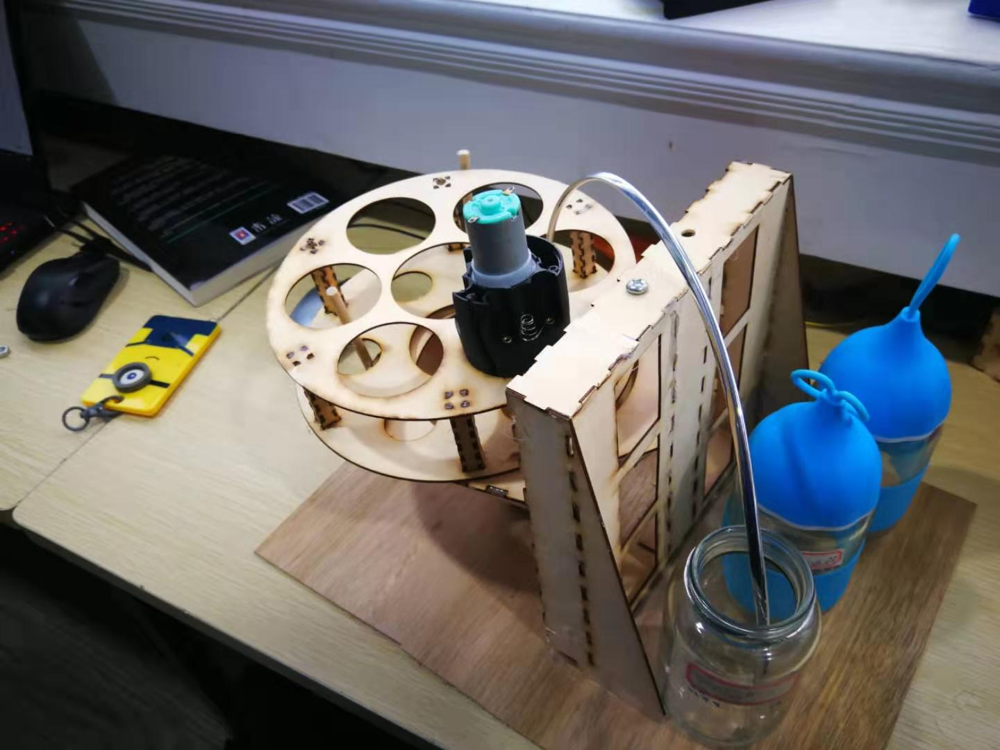

# 题目  基于Python的智能厨房小助手开发
组长：朱宇菘  
指导老师：谢凯年  
班级：高一（3） 
日期：2019.4.5  

# 摘要

在___的时候，经常会___   本研究针对___的问题， 设计了一种____   它能够____ 。  装置综合利运用_____ 技术 ，在____技术的帮助下，能够_______.  经____验证，可以用——————————————的性能完成——————————操作。

1.利用Pytho和网络爬虫得到菜谱  
2.分析菜谱得到调味品与主料的比例  
3.够混合液体和粉末的混合头装置  
4.语音交互简化操作  

## 关键词
* 1.厨房助手    
* 2.调料混合
* 3.菜谱检测
* 4.网络爬虫
* 5.自然语言处理
* 6.语音识别

# 正文 

## 1. 引言
现在的生活节奏加快，年轻人业余时间少， 但又希望体验烹饪的乐趣。 由于烹饪经验不足，需要先网上查菜谱，然后烹饪。

买回烹饪的主料以后， 按照菜谱做菜时，调味品的比例需要根据主料的重量计算，然后混合，非常麻烦，调料混合时锅里还在烹饪，掌握不好，容易手忙脚乱，造成烧糊等现象。 有时候调料比例计算错误，导致过甜，过咸，口味不佳。 

因此，希望有一种可以自动计算调料比例并且自动混合的厨房机器人问世，为年轻人提供更好的烹饪体验，传承中华美食文化。

## 2. 研究背景

### 2.1 研究意义与国内外研究现状

针对——————的问题， 我们查找了——————的资料。 发现：

1.淘宝上

2.专利上

3.学术论文上

日常生活中，最接近我们的是小美。 它能够。。。。。。。但是，不能够。。。。。。。

厨师机：小美  
具有进行烹饪的能力，可以在人给定菜式并加入调料的情况下代替人工进行多种形式的料理。

国际上，我们用————————关键词进行了检索，发现————————————————。

### 2.2 相关概念及其含义的界定

经调研发现。相关产品如下

1.做饭机器人

2.智能厨房

3.智能家电

我着手研发的厨房助手是与小美互补的存在，不执行烹饪，但是可以帮助厨师快速配置调料，也可以帮助小白进行菜品口味把控。

## 3. 研究对象和方法

### 3.1 方法

设计一种烹饪酱汁混合机器人，可以根据菜谱以及主料的重量，自动完成酱汁的配制，方便烹饪。
具体功能如下：
1. 能够用语音与用户对话，得知要做什么菜
2. 能够提示用户根据几人份的要求，称重准备特定重量的主料
3. 利用网络爬虫的得到菜谱
4. 根据主料重量计算出配料。
5. 将酱油，醋，油，料酒，盐，味精，糖根据菜谱和主料重量计算出的重量充分混合做成酱汁。
6. 语音提示操作步骤和酱汁加入的时机。

### 3.2 系统结构
#### 1.系统总体结构
  
通过从用户处采集的语音，使用互联网获取菜谱，并由树莓派进行处理、下达命令，由Arduino控制执行。
#### 2.机械结构设计
  
设计了六个固体调料投放孔以及一个液体调料投放口，固体调料投放采用研磨器改装，液体调料用水泵输送。
#### 3.电路设计
  
电路采用开源硬件Arduino以及树莓派控制六联继电器实现自动控制，可以实现对六种调料的投放。
#### 4.软件设计
  
软件使用Python编写，结合了语音识别与自然语言处理，实现人机交互；接着通过对于菜谱的检索获取调料信息，使用树莓派向Arduino发送信号，控制调料配制。

## 4. 调查结果与数据分析
### 4.1 
根据调查结果，可知在各年龄段大多数过下厨的人群中，出现了对于烹饪的水平参差现象，同时年轻人对于烹饪的热情不高，倾向点外卖，虽然有人配置了小美但是对其操作并不熟悉，大多数人希望有一款这样的厨师助手出现。
### 4.2
经过试验，取得了各马达每秒输送的调料量，通过这一试验可以通过控制时间实现调料的量化控制。
## 5. 讨论

# 结论

# 不足与有待研究之处
现有六联继电器控制方法无法控制多于六个马达，可以在马达控制电路上再做文章。  
网络爬虫无法访问所有网站，故菜谱有局限，可添加本地菜谱来扩充。

# 致谢

# 参考文献

# 附录
调查初始数据
Python与树莓派之间的通信协议
A: 1 - on  
a: 1 - off  
B: 2 - on  
b: 2 - off  
C: 3 - on  
c: 3 - off  
D: 4 - on  
d: 4 - off  
E: 5 - on  
e: 5 - off  
F: 6 - on  
f: 6 - off  
