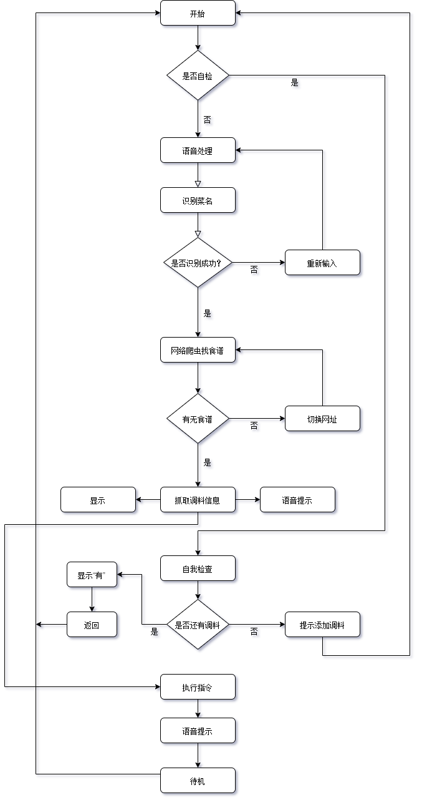

# 题目

# 摘要

## 关键词

# 正文 

## 1. 引言
现在的生活节奏加快，年轻人业余时间少， 但又希望体验烹饪的乐趣。 由于烹饪经验不足，需要先网上查菜谱，然后烹饪。

买回烹饪的主料以后， 按照菜谱做菜时，调味品的比例需要根据主料的重量计算，然后混合，非常麻烦，调料混合时锅里还在烹饪，掌握不好，容易手忙脚乱，造成烧糊等现象。 有时候调料比例计算错误，导致过甜，过咸，口味不佳。 

因此，希望有一种可以自动计算调料比例并且自动混合的厨房机器人问世，为年轻人提供更好的烹饪体验，传承中华美食文化。

## 2. 研究背景

### 2.1

### 2.2 

## 3. 研究对象和方法
### 3.1 方法
设计一种烹饪酱汁混合机器人，可以根据菜谱以及主料的重量，自动完成酱汁的配制，方便烹饪。
具体功能如下：
1. 能够用语音与用户对话，得知要做什么菜
2. 能够提示用户根据几人份的要求，称重准备特定重量的主料
3. 利用网络爬虫的得到菜谱
4. 根据主料重量计算出配料。
5. 将酱油，醋，油，料酒，盐，味精，糖根据菜谱和主料重量计算出的重量充分混合做成酱汁。
6. 语音提示操作步骤和酱汁加入的时机。

### 3.2 系统结构
#### 1.电路设计

#### 2.软件设计

#### 3.机械结构设计

## 4.系统结构

## 4. 调查结果与数据分析

## 5. 讨论

# 结论

